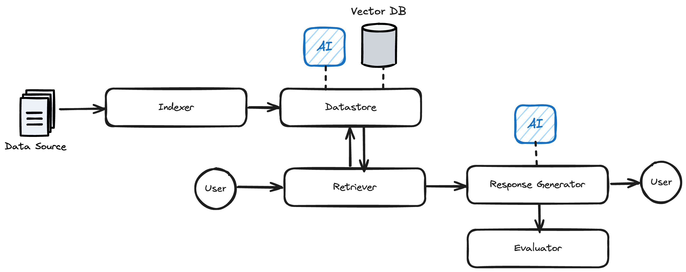

# Simple RAG Pipeline

A Retrieval Augmented Generation (RAG) system with Claude AI integration and local embeddings support. This project demonstrates how to build a complete RAG pipeline that can index documents, retrieve relevant content, generate AI-powered responses, and evaluate results—all through a command line interface (CLI).

**Author:** Gunnar MUC  
**Repository:** https://github.com/GunnarMUC/simple-rag-pipe



## Overview

The RAG Framework lets you:

- **Index Documents:** Process and break documents (e.g., PDFs) into smaller, manageable chunks.
- **Store & Retrieve Information:** Save document embeddings in a vector database (using LanceDB) and search using similarity.
- **Generate Responses:** Use Claude AI model to provide concise answers based on the retrieved context.
- **Evaluate Responses:** Compare the generated response against expected answers and view the reasoning behind the evaluation.

## Key Features

- **Claude AI Integration:** Uses Anthropic's Claude for text generation
- **Local Embeddings:** Uses sentence-transformers for vector embeddings (no API costs)
- **Graceful Fallbacks:** Handles missing API keys gracefully
- **Modular Architecture:** Easy to extend and customize components

## Architecture

- **Pipeline (src/rag_pipeline.py):**  
  Orchestrates the process using:

  - **Datastore:** Manages embeddings and vector storage using LanceDB.
  - **Indexer:** Processes documents and creates data chunks using the Docling package.
  - **Retriever:** Searches the datastore to pull relevant document segments with optional Cohere reranking.
  - **ResponseGenerator:** Generates answers by calling the Claude AI service.
  - **Evaluator:** Compares the AI responses to expected answers and explains the outcome.

- **Interfaces (interface/):**  
  Abstract base classes define contracts for all components (e.g., BaseDatastore, BaseIndexer, BaseRetriever, BaseResponseGenerator, and BaseEvaluator), making it easy to extend or swap implementations.

## Installation

#### Set Up a Virtual Environment (Optional but Recommended)

```bash
python -m venv venv
source venv/bin/activate   # On Windows: venv\Scripts\activate
```

#### Install Dependencies

```bash
pip install -r requirements.txt
```

#### Configure Environment Variables

Create a `.env` file in the project root with your API keys:

```sh
ANTHROPIC_API_KEY=your_claude_api_key_here
CO_API_KEY=your_cohere_api_key_here  # Optional for reranking
```

## Usage

The CLI provides several commands to interact with the RAG pipeline. By default, they will use the source/eval paths specified in `main.py`, but there are flags to override them.

```python
DEFAULT_SOURCE_PATH = "sample_data/source/"
DEFAULT_EVAL_PATH = "sample_data/eval/sample_questions.json"
```

#### Run the Full Pipeline

This command resets the datastore, indexes documents, and evaluates the model.

```bash
PYTHONPATH=src python3 main.py run
```

#### Reset the Database

Clears the vector database.

```bash
PYTHONPATH=src python3 main.py reset
```

#### Add Documents

Index and embed documents. You can specify a file or directory path.

```bash
PYTHONPATH=src python3 main.py add -p "sample_data/source/"
```

#### Query the Database

Search for information using a query string.

```bash
PYTHONPATH=src python3 main.py query "What are the main attractions?"
```

#### Evaluate the Model

Use a JSON file (with question/answer pairs) to evaluate the response quality.

```bash
PYTHONPATH=src python3 main.py evaluate -f "sample_data/eval/sample_questions.json"
```

## Dependencies

- **Claude AI:** For text generation and responses
- **Sentence Transformers:** For local vector embeddings
- **LanceDB:** Vector database for storing embeddings
- **Docling:** Document processing and chunking
- **Cohere:** Optional reranking functionality

## License

This project is licensed under the MIT License.
